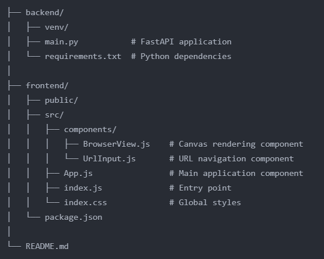

# Browser Automation Streaming

A real-time browser automation and streaming application built with `FastAPI` and `React`. The application allows users to control a headless Chrome browser instance remotely through a web interface, with live interaction capabilities.

# Overview

This project implements a browser automation system with real-time streaming capabilities. It consists of:

1. A FastAPI backend that manages browser sessions using `Selenium`
2. A React frontend that provides a user interface for browser interaction
3. `WebSocket` communication for real-time browser frame streaming and user input handling

# Requirements
**Backend**

  1. Python 3.8+
  2. FastAPI
  3. Selenium WebDriver
  4. uvicorn (ASGI server)
  5. Pillow (Python Imaging Library)

**Frontend**

  1. Node.js 14+
  2. React 18+
  3. WebSocket client
  4. Modern web browser with canvas support

# Tools & Technologies Used
**Backend**

  **1. FastAPI:** High-performance Python web framework for building APIs
  
  **2. Selenium:** Browser automation tool
  
  **3. WebSocket:** Real-time bi-directional communication
  
  **4. Pillow:** Image processing and optimization

**Frontend**

  **1. React:** UI framework
  
  **2. WebSocket API:** Real-time communication with backend
  
  **3. Canvas API:** Browser frame rendering
  
  **4. CSS3:** Styling and layout

# Installation & Configuration
**Backend Setup**

1. Create and activate a virtual environment:

`python -m venv venv`

`.\venv\Scripts\activate  # Windows`

`source venv/bin/activate  # Unix/MacOS`

2. Install required packages:

`pip install fastapi uvicorn selenium pillow python-multipart`

3. Start the backend server:

`uvicorn main:app --reload`

**Frontend Setup**

1. Create a new React application:

`npx create-react-app browser-automation-frontend`

`cd browser-automation-frontend`

2. Install dependencies:

`npm install`

3. Start the development server:

`npm start`

# Project Structure

  

# Key Features

**Browser Session Management**

  1. Creates and manages headless Chrome browser sessions
  2. Unique session IDs for multiple concurrent users

**Real-time Streaming**

  1. Continuous frame capture and streaming via WebSocket
  2. Image optimization for better performance

**Interactive Control**

  1. Mouse click simulation
  2. Keyboard input handling
  3. URL navigation

**Error Handling**

  1. Graceful connection management
  2. Session cleanup on shutdown
  3. Error logging and reporting
